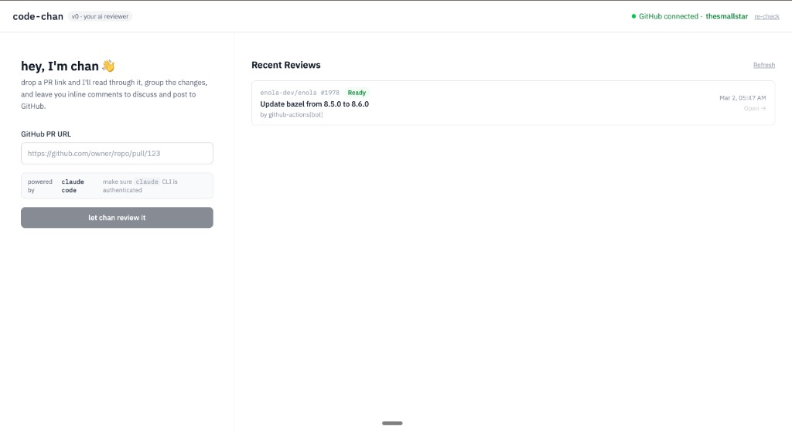
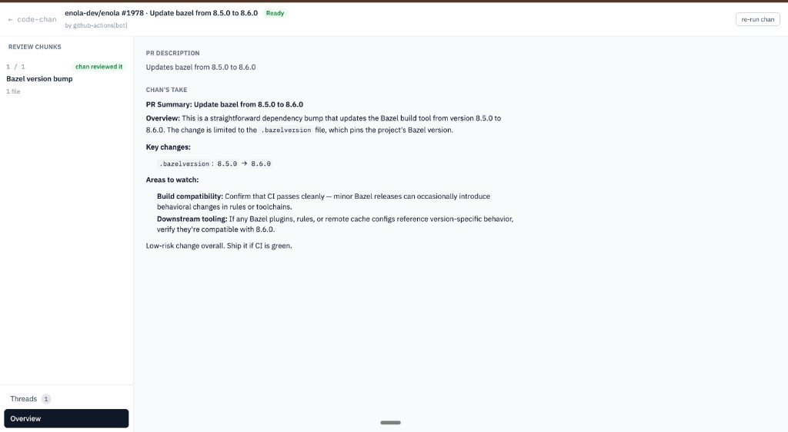
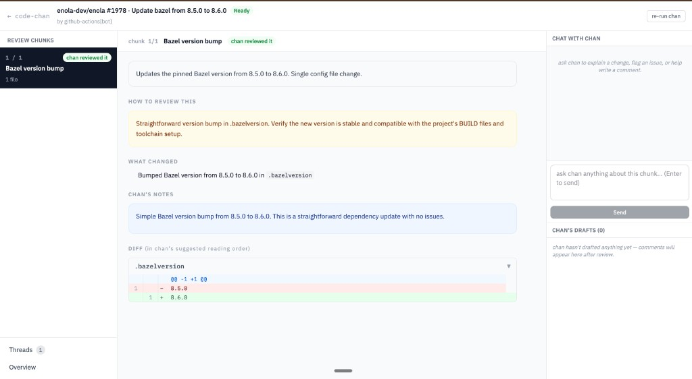

> ⚠️ **Vibecoded** — this project was built fast with AI assistance. It works, but expect rough edges. Review the code before deploying anywhere sensitive. PRs and issues very welcome.

---

<div align="center">
  
</div>

# code-chan

**AI-assisted code review, powered by Claude Code CLI.**

Paste a GitHub PR link → chan reads the whole diff, groups changes into logical review chunks, writes a walkthrough for each one, suggests inline comments you can edit and post directly to GitHub, and lets you chat with it about any part of the code.







---

## Features

- **Contextual chunking** — chan decides how to group changed files, not a dumb heuristic. Each chunk gets a purpose, a walkthrough, and a suggested reading order.
- **Inline comments** — AI-suggested comments are anchored to real diff lines. Edit, delete, or post them directly to GitHub with one click.
- **Chat per chunk** — ask chan anything about a specific set of changes. It has access to the full cloned repo.
- **Thread discussion** — see existing PR comments with replies nested. Ask chan about any thread: "is this concern valid?", "how should I address this?"
- **No API keys** — uses `claude` CLI (Claude Code) and `gh` CLI. Auth happens through the tools you already have.
- **Fully local** — SQLite database, cloned repos stay on your machine, nothing leaves except GitHub API calls.

---

## Quick Start

### Prerequisites

| Tool | Install |
|------|---------|
| `claude` CLI | [claude.ai/code](https://claude.ai/code) → `claude auth login` |
| `gh` CLI | [cli.github.com](https://cli.github.com) → `gh auth login` |
| Python 3.13+ | [python.org](https://python.org) |
| Node 18+ | [nodejs.org](https://nodejs.org) |
| `uv` | `curl -LsSf https://astral.sh/uv/install.sh \| sh` |

### Install & run

```bash
git clone https://github.com/your-username/code-chan
cd code-chan

make install   # installs Python + Node deps
make dev       # starts backend :8000 + frontend :3000
```

Open **http://localhost:3000**, paste a GitHub PR URL, and hit **let chan review it**.

---

## Usage

### 1. Paste a PR link

```
https://github.com/owner/repo/pull/123
```

chan will:
1. Fetch the PR metadata, diffs, and existing comments from GitHub
2. Clone the repo locally (shallow, `--depth 1`) so it can read full file context
3. Generate a plain-English summary of what the PR does
4. Group changed files into logical review chunks (decided by chan, not rules)
5. For each chunk: write a walkthrough, summarize what changed, and suggest inline comments

### 2. Walk through each chunk

Each chunk in the sidebar shows:
- **Purpose** — why these files belong together
- **How to review this** — what to focus on, what to watch for
- **What changed** — bullet-point summary
- **chan's notes** — specific concerns and suggestions
- **Diff** — in chan's suggested reading order, with hover buttons to add your own comments

### 3. Review and send comments

AI-suggested comments land in **chan's drafts**. You can:
- **Edit** the body before posting
- **Delete** ones you don't agree with
- **Send to GitHub** — posts as an inline review comment on the exact line

### 4. Discuss threads

Open the **Threads** tab to see existing PR comments with all replies. Hit **ask chan** on any thread to discuss it inline — chan has the diff hunk, file context, and full comment history.

### 5. Re-run

Hit **re-run chan** in the top bar to re-fetch the PR and re-run the full review (useful after new commits are pushed).

---

## Stack

| Layer | Tech |
|-------|------|
| Frontend | React 19 + Vite + Tailwind CSS v4 |
| Backend | FastAPI + SQLAlchemy (SQLite) |
| AI | Claude Code CLI (`claude -p`) |
| GitHub | `gh` CLI + GitHub REST API |
| Python env | `uv` |

---

## Project structure

```
code-chan/
├── backend/
│   └── app/
│       ├── github/          # GitHub API client, diff parser, repo clone manager
│       ├── ai/              # Claude Code CLI provider (+ codex stub for contributors)
│       ├── reviews/         # LLM-based chunker, review pipeline service
│       ├── routers/         # FastAPI route handlers
│       ├── models.py        # SQLAlchemy models
│       ├── schemas.py       # Pydantic schemas (API contract)
│       └── main.py
├── frontend/
│   └── src/
│       ├── pages/           # Landing, ReviewInstance
│       └── components/      # DiffView, ChunkList, ChatPanel, DraftComments, ThreadsPanel
├── docs/                    # Architecture, setup, contributing guides
├── data/                    # SQLite DB (gitignored)
├── repos/                   # Cloned repos for AI context (gitignored)
└── Makefile
```

---

## Docs

- [Architecture](docs/architecture.md) — how it works end-to-end
- [Setup](docs/setup.md) — detailed setup for different environments
- [Contributing](docs/contributing.md) — how to add features, providers, or fix bugs

---

## Roadmap

- [ ] GitHub App / CI mode (run chan on every PR automatically)
- [ ] Persistent chat history across sessions
- [ ] Support for GitLab / Bitbucket
- [ ] Additional AI providers (Codex, Gemini, local models via Ollama)
- [ ] PR comparison view (base vs head)
- [ ] Configurable review rules / prompts per repo

---

## Contributing

Contributions are welcome. See [docs/contributing.md](docs/contributing.md) for details.

---

## License

MIT — see [LICENSE](LICENSE).

---

> **on the name** — *code-chan* is inspired by *vivachan* (विवेचन), a Sanskrit word meaning analysis or critical examination. chan for short.
